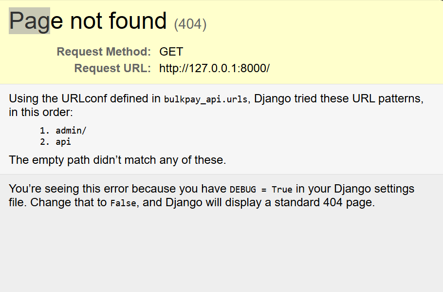
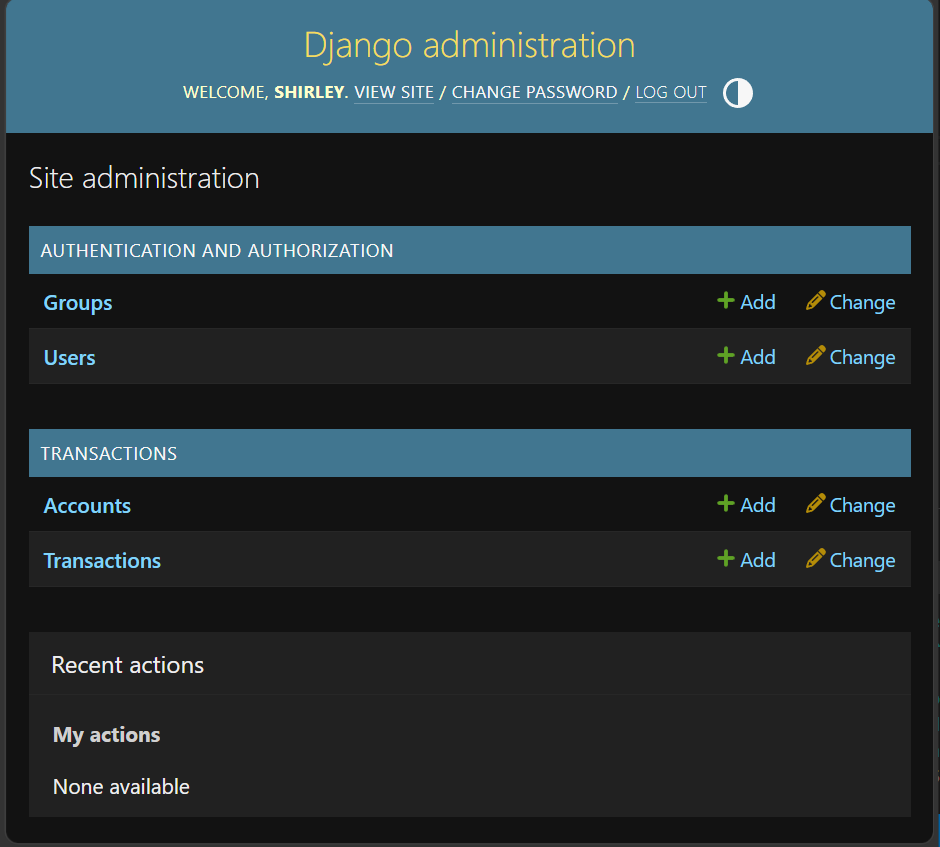

# BulkPay API

A Django REST Framework API that efficiently processes bulk financial transactions across multiple accounts in a single request. The API validates all incoming data using nested serializers and optimizes database operations using Django's `bulk_create()`.

---

## Main Objectives

- Process multiple accounts and their transactions in one API request.
- Validate all incoming data before saving to the database.
- Insert transactions efficiently using `bulk_create()`.
- Return clear success and error responses.
- Demonstrate clean and scalable backend development with Django REST Framework.

---

## Tech Stack

- Python 3.x
- Django
- Django REST Framework
- SQLite
- Git & GitHub

---

## Project Structure

```
bulkpay_api/
│
├── transactions/
│   ├── migrations/
│   ├── models.py
│   ├── serializers.py
│   ├── views.py
│   ├── urls.py
│   └── ...
│
├── bulkpay_api/
│   ├── settings.py
│   ├── urls.py
│   └── ...
│
├── db.sqlite3
├── manage.py
├── requirements.txt
└── README.md
```

---

## Installation

### 1. Clone the repository


### 2. Navigate into the project

```bash
cd bulkpay_api
```

### 3. Create and activate a virtual environment

**Windows**

```bash
python -m venv env
env\Scripts\activate
```

**Linux/macOS**

```bash
python3 -m venv env
source env/bin/activate
```

### 4. Install dependencies

```bash
pip install -r requirements.txt
```

### 5. Apply migrations

```bash
python manage.py migrate
```

### 6. Run the development server

```bash
python manage.py runserver
```

The API will be available at:

```
http://127.0.0.1:8000/
```

---

## API Endpoint

### Bulk Transaction Endpoint

**POST**

```
/api/transactions/bulk/
```

---

## Sample Request

```json
{
  "accounts": [
    {
      "name": "John Mwangi",
      "account_number": "KE001234",
      "transactions": [
        {
          "reference": "TXN-001",
          "amount": "1500.00",
          "transaction_type": "credit",
          "description": "Salary Payment"
        },
        {
          "reference": "TXN-002",
          "amount": "500.00",
          "transaction_type": "debit",
          "description": "Utility Bill"
        }
      ]
    },
    {
      "name": "Jane Wanjiku",
      "account_number": "KE009876",
      "transactions": [
        {
          "reference": "TXN-003",
          "amount": "2500.00",
          "transaction_type": "credit",
          "description": "Project Payment"
        }
      ]
    }
  ]
}
```

---

## Sample Success Response

```json
{
  "message": "Bulk transactions created successfully.",
  "accounts_created": 2,
  "transactions_created": 3
}
```

---

## Validation

The API validates all incoming request data using Django REST Framework serializers before any database operations are performed.

Validation includes:

- Required fields
- Valid transaction types
- Correct amount format
- Nested transaction validation
- Prevention of invalid data from being saved

---

## Database Optimization

The API uses Django's `bulk_create()` to efficiently insert multiple transaction records in a single database query, reducing database overhead and improving performance when processing bulk requests.

---

## Testing

Tested the API using:

- Postman
---

## Future Improvements

- User authentication and authorization
- Transaction history endpoints
- Filtering and search functionality
- PostgreSQL integration
- API documentation using Swagger/OpenAPI

---

## Project images







## Author

**Shirley Mengesa**

Backend Developer | Python | Django | Django REST Framework

GitHub: https://github.com/shirley-girl
